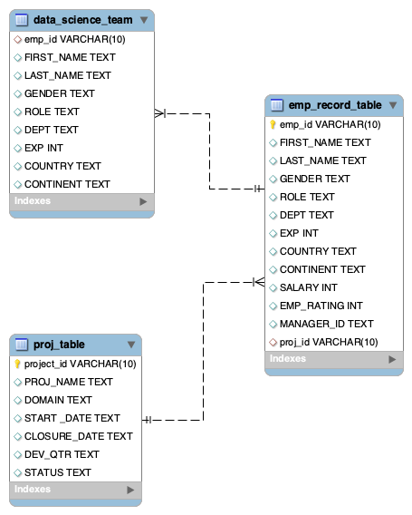

_css chunk to make tables fit_

```{css toc-content, echo = FALSE}
#TOC {
  margin: 3px 0px 3px 3px;
}

td{font-size: 12px;}
```

_Hidden code chunk for mypassword_

_Make a MySQL connection from Rmarkdown_

```{r setup, comment = NA, message = FALSE, warning = FALSE }
library(DBI)
library(dplyr)
library(dbplyr)

## mypassword = {}!

conn <- dbConnect(RMySQL::MySQL(),
                  dbname = "",
                  Server = "localhost",
                  port = 3306,
                  user = "root",
                  password = mypassword)

knitr::opts_chunk$set(connection = "conn", echo = TRUE, comment = NA, message = FALSE, warning = FALSE)

```


# Course-end Project 1 - ScienceQtech Employee Performance Mapping...

## Description

ScienceQtech is a startup that works in the Data Science field. ScienceQtech has worked on fraud detection, market basket, self-driving cars, supply chain, algorithmic early detection of lung cancer, customer sentiment, and the drug discovery field. With the annual appraisal cycle around the corner, the HR department has asked you (Junior Database Administrator) to generate reports on employee details, their performance, and on the project that the employees have undertaken, to analyze the employee database and extract specific data based on different requirements.

 

## Objective: 

To facilitate a better understanding, managers have provided ratings for each employee which will help the HR department to finalize the employee performance mapping. As a DBA, you should find the maximum salary of the employees and ensure that all jobs are meeting the organization's profile standard. You also need to calculate bonuses to find extra cost for expenses. This will raise the overall performance of the organization by ensuring that all required employees receive training.

__Note: You must download the dataset from the course resource section in LMS and create a table to perform the above objective.__

## Dataset description:

### emp_record_table: It contains the information of all the employees.
  - EMP_ID – ID of the employee
  - FIRST_NAME – First name of the employee
  - LAST_NAME – Last name of the employee
  - GENDER – Gender of the employee
  - ROLE – Post of the employee
  - DEPT – Field of the employee
  - EXP – Years of experience the employee has
  - COUNTRY – Country in which the employee is presently living
  - CONTINENT – Continent in which the country is
  - SALARY – Salary of the employee
  - EMP_RATING – Performance rating of the employee
  - MANAGER_ID – The manager under which the employee is assigned 
  - PROJ_ID – The project on which the employee is working or has worked on

### Proj_table: It contains information about the projects.
  - PROJECT_ID – ID for the project
  - PROJ_Name – Name of the project
  - DOMAIN – Field of the project
  - START_DATE – Day the project began
  - CLOSURE_DATE – Day the project was or will be completed
  - DEV_QTR – Quarter in which the project was scheduled
  - STATUS – Status of the project currently

### Data_science_team: It contains information about all the employees in the Data Science team.

  - EMP_ID – ID of the employee
  - FIRST_NAME – First name of the employee
  - LAST_NAME – Last name of the employee
  - GENDER – Gender of the employee
  - ROLE – Post of the employee
  - DEPT – Field of the employee
  - EXP – Years of experience the employee has
  - COUNTRY – Country in which the employee is presently living
  - CONTINENT – Continent in which the country is

## The tasks to be performed: 

### 1. Create a database named employee, then import tables into the employee database from the given resources.
     - data_science_team.csv 
     - proj_table.csv and 
     - emp_record_table.csv


__Answer-1:__ _Done: Using the import function of MySQLWorkbench._ 

> set nocount on  
> ! This works with SQL database to run multiple queries from a code chunk. This does not work with MySQL and therefore I need to use one query per code chunk          


1. Initiate use of our database.   

```{sql setup_db, connection=conn }
use employee
```
2. Look at tables available in _employee_:  

```{sql, connection=conn }
SHOW TABLES;
```
3. Fix _the proj_table_   
- Alter table as text feild _project_id_ cannot be __PRIMARY KEY__    

```{sql Q1.3.1 proj_table, connection=conn, eval=FALSE }
ALTER TABLE proj_table
	MODIFY COLUMN project_id VARCHAR(10)
```

```{sql Q1.3.2 proj_table, connection=conn, eval=FALSE  }
ALTER TABLE proj_table
	ADD PRIMARY KEY(project_id)
```
    
- Our altered table  
    
```{sql Q1.3.3 proj_table show, connection=conn }
SELECT * FROM proj_table
```
  
4. Fix _emp_record_table_   
- Lets look at the table    
      
```{sql Q1.4.1 emp_record_table, connection=conn }
SELECT * FROM emp_record_table
```

- Alter the table and put _emp_id_ as __PRIMARY_KEY__    
      
```{sql Q1.4.2 emp_record_table, connection=conn, eval=FALSE  }
ALTER TABLE emp_record_table
	MODIFY COLUMN emp_id VARCHAR(10)
```
    
```{sql Q1.4.3 emp_record_table, connection=conn, eval=FALSE  }
ALTER TABLE emp_record_table
	ADD PRIMARY KEY(emp_id)
```
  
- _proj_id_ needs to be set as __FOREIGN_KEY__     
- it cannot be NA or Null!    |      
- feild type also needs to match in the two tables     

```{sql Q1.4.4 emp_record_table, connection=conn }
SELECT * FROM emp_record_table
WHERE proj_id = 'NA' OR proj_id IS NULL
```
- Fix the NA values in _proj_id_  

>In case of Error: 1175- go to menu "MySQLWorkbench" > "Settings" > "SQL Editor" > uncheck "Safe Updates"_  
>_on PC it is under "edit"_  

```{sql Q1.4.5 emp_record_table, connection=conn, eval=FALSE  }

UPDATE emp_record_table
	SET proj_id=NULL
    WHERE proj_id='NA'
```
    
- Now change type to match the proj_table.   
    
    
```{sql Q1.4.6 emp_record_table, connection=conn, eval=FALSE  }

ALTER TABLE emp_record_table
	MODIFY COLUMN proj_id VARCHAR(10)
```

```{sql Q1.4.7 emp_record_table, connection=conn, eval=FALSE  }
ALTER TABLE emp_record_table
	ADD CONSTRAINT fk_proj
    FOREIGN KEY(proj_id) REFERENCES proj_table(PROJECT_ID)
```


- Let's see the altered table:  


```{sql Q1.4.8 emp_record_table, connection=conn }
DESCRIBE emp_record_table
```

5. Similarly fix the _data_science_team_.   
```{sql Q1.5.1 data_science_team, connection=conn }
SELECT * FROM data_science_team
```

- match emp_id to emp_record_table  

```{sql Q1.5.2 data_science_team, connection=conn, eval=FALSE  }
ALTER TABLE data_science_team
	MODIFY COLUMN emp_id VARCHAR(10)
```

```{sql Q1.5.3 data_science_team, connection=conn, eval=FALSE  }
ALTER TABLE data_science_team
	ADD CONSTRAINT fk_emp_record_table_emp_id
	FOREIGN KEY(emp_id) REFERENCES emp_record_table(emp_id)
```
  
  
### 2. Create an ER diagram for the given employee database.    
__Answer-2:__ goto "database" > "Reverse Engineer" and follow prompts to get __Figure-1__

  
 

### 3. Write a query to fetch EMP_ID, FIRST_NAME, LAST_NAME, GENDER, and DEPARTMENT from the employee record table, and make a list of employees and details of their department.  

```{sql Q3.1 emp_record_table, connection=conn }

SELECT emp_id, first_name, last_name, gender, dept
	FROM emp_record_table

```
 

### 4. Write a query to fetch EMP_ID, FIRST_NAME, LAST_NAME, GENDER, DEPARTMENT, and EMP_RATING if the EMP_RATING is:   

-__4.1 _emp_rating_ less than two__  

```{sql Q4.1 Employee rating filter, connection=conn }

SELECT emp_id, first_name, last_name, gender, dept
	FROM emp_record_table
    WHERE emp_rating < 2

```

-__4.2 _emp_rating_ greater than four__    

```{sql Q4.2 Employee rating filter, connection=conn }

SELECT emp_id, first_name, last_name, gender, dept
	FROM emp_record_table
    WHERE emp_rating > 4

```

-__4.3 _emp_rating_ Between two and four__  

```{sql Q4.3 Employee rating filter, connection=conn }

SELECT emp_id, first_name, last_name, gender, dept
	FROM emp_record_table
    WHERE emp_rating BETWEEN 2 AND 4

```

-__4.4 _emp_rating_ bins__    

```{sql Q4.4  Employee rating filter, connection=conn }

SELECT emp_id, first_name, last_name, gender, dept
	FROM emp_record_table
    WHERE emp_rating < 2 OR emp_rating BETWEEN 2 AND 4 OR emp_rating > 4

```


### 5. Write a query to concatenate the FIRST_NAME and the LAST_NAME of employees in the Finance department from the employee table and then give the resultant column alias as NAME.  

```{sql Q5 Concatenate, connection=conn }
SELECT CONCAT(first_name, ",", last_name) AS NAME FROM emp_record_table
	WHERE dept='FINANCE'
```

### 6. Write a query to list only those employees who have someone reporting to them. Also, show the number of reporters (including the President).  

```{sql Q6 reporting_people, connection=conn }
SELECT * FROM emp_record_table
	WHERE emp_id IN (SELECT DISTINCT manager_id from emp_record_table)
```

### 7. Write a query to list down all the employees from the healthcare and finance departments using union. Take data from the employee record table.  

```{sql Q7 filter by finance and dept, connection=conn }
SELECT * FROM emp_record_table
	WHERE dept = 'HEALTHCARE'
UNION
SELECT * FROM emp_record_table
	WHERE dept = 'FINANCE'
```
 

### 8. Write a query to list down employee details such as EMP_ID, FIRST_NAME, LAST_NAME, ROLE, DEPARTMENT, and EMP_RATING grouped by dept. Also include the respective employee rating along with the max emp rating for the department.    

```{sql Q8 GROUP BY, connection=conn }

SELECT emp_id, first_name, last_name, role, dept, MAX(emp_rating) AS max_emp_rating
	FROM emp_record_table
-- this GROUP BY is used for max_emp_rating
	GROUP BY emp_id, first_name, last_name, role, dept

```
 

### 9. Write a query to calculate the minimum and the maximum salary of the employees in each role. Take data from the employee record table.  

```{sql Q9 Min_Max_by_Role, connection=conn }
SELECT ROLE, MIN(salary), MAX(salary) 
	FROM emp_record_table
    GROUP BY ROLE
```

### 10. Write a query to assign ranks to each employee based on their experience. Take data from the employee record table.  

```{sql Q10 Assign Ranks, connection=conn }
SELECT *, RANK() OVER (ORDER by exp DESC)
	FROM emp_record_table
```

_NB: Lets understand this one-_  
- _SELECT *: This selects all columns from the emp_record_table._  
- _RANK() OVER (ORDER by exp DESC): This is a window function that calculates the rank of each record based on the exp column in descending order._  
- _The ORDER BY exp DESC specifies that the records should be ranked based on the exp column in descending order_  

### 11. Write a query to create a view that displays employees in various countries whose salary is more than six thousand. Take data from the employee record table.  
_Can't have two views by the same name!_  
```{sql Q11.1 VIEW, connection=conn }

DROP VIEW IF EXISTS vw_country

```

```{sql Q11.2 VIEW, connection=conn }

CREATE VIEW vw_country
	AS
    SELECT first_name, last_name, country FROM emp_record_table
    WHERE salary > 6000
    
```

### 12. Write a nested query to find employees with experience of more than ten years. Take data from the employee record table.  

```{sql Q12 NESTED QUERY, connection=conn }
SELECT * FROM
(
  SELECT * FROM emp_record_table
	  WHERE exp > 10
) AS T

```
 

### 13. Write a query to create a _stored procedure_ to retrieve the details of the employees whose experience is more than three years. Take data from the employee record table.   
- Need to drop procedure if exists  

```{sql Q13.1 DROP PROCEDURE, connection=conn }

DROP PROCEDURE IF EXISTS sp_exp;
```

```{sql Q13.2 CREATE PROCEDURE, connection=conn }

CREATE PROCEDURE sp_exp()
BEGIN
    SELECT * FROM emp_record_table WHERE exp > 3;
END;


```


__In MySQLWorkbench we need a delimiter change. The code would therefore be-__
  
> DELIMITER //  
>  
>CREATE PROCEDURE sp_exp()  
>BEGIN  
>    SELECT * FROM emp_record_table WHERE exp > 3;  
>END//
>  
>DELIMITER ;  


_Here, // is used as the delimiter. It's changed back to ; after the stored procedure definition._  

_This ensures that the SQL interpreter doesn't interpret the semicolons within the stored procedure as statement terminators until the entire procedure is defined._  


### 14. Write a query using stored functions in the project table to check whether the job profile assigned to each employee in the data science team matches the organization’s set standard.  
The standard being:  
- For an employee with experience less than or equal to 2 years assign 'JUNIOR DATA SCIENTIST',  
- For an employee with the experience of 2 to 5 years assign 'ASSOCIATE DATA SCIENTIST',  
- For an employee with the experience of 5 to 10 years assign 'SENIOR DATA SCIENTIST',  
- For an employee with the experience of 10 to 12 years assign 'LEAD DATA SCIENTIST',  
- For an employee with the experience of 12 to 16 years assign 'MANAGER'.  

```{sql Q14.1 CASE WHEN, connection=conn }
SELECT * ,
	CASE WHEN exp <= 2 THEN 'JUNIOR DATA SCIENTIST'
    WHEN exp > 2 AND EXP  <= 5 THEN 'ASSOCIATE DATA SCIENTIST'
    WHEN exp > 5 AND EXP  <= 10 THEN 'SENIOR DATA SCIENTIST'
    WHEN exp > 10 AND EXP  <= 12 THEN 'LEAD DATA SCIENTIST'
    WHEN exp > 12 AND EXP  <= 16 THEN 'MANAGER'
    END AS designation
FROM emp_record_table

```
 
- If we were to add a column like this -   
```{sql Q14.2 CASE WHEN, connection=conn, eval=FALSE }
ALTER TABLE emp_record_table
	ADD designation VARCHAR(50)
```

```{sql Q14.3 CASE WHEN, connection=conn, eval=FALSE  }
UPDATE emp_record_table
	SET designation=CASE WHEN exp <= 2 THEN 'JUNIOR DATA SCIENTIST'
		WHEN exp > 2 AND EXP  <= 5 THEN 'ASSOCIATE DATA SCIENTIST'
		WHEN exp > 5 AND EXP  <= 10 THEN 'SENIOR DATA SCIENTIST'
		WHEN exp > 10 AND EXP  <= 12 THEN 'LEAD DATA SCIENTIST'
		WHEN exp > 12 AND EXP  <= 16 THEN 'MANAGER'
	END
```

_lets remove this __designation__ column before moving on_  

```{sql Q14.4 CASE WHEN, connection=conn, eval=FALSE  }
ALTER TABLE emp_record_table
	DROP COLUMN designation
```

### 15. Create an index to improve the cost and performance of the query to find the employee whose FIRST_NAME is ‘Eric’ in the employee table after checking the execution plan.  

- index helps in speeding up queries, its performance is quite observable in large datasets.  
- index actually creates a backend table that would keep a ~binary record of these values.  
- text was not compatible with indexing so we need to change to __VARCHAR__  

```{sql Q15.1 INDEX, connection=conn }
ALTER TABLE emp_record_table
	MODIFY COLUMN first_name VARCHAR(20)
```


```{sql Q15.2 INDEX, connection=conn, eval=FALSE }
CREATE INDEX ix_firstname ON emp_record_table(FIRST_NAME)
```

- This table is too short to tell the difference in query time  

```{sql Q15.3 INDEX QUERY, connection=conn, eval=TRUE }
SELECT * FROM emp_record_table WHERE first_name = "eric"
```

### 16. Write a query to calculate the bonus for all the employees, based on their ratings and salaries (Use the formula: 5% of salary * employee rating).

```{sql Q16 bonus, connection=conn }
SELECT * , salary*0.05*emp_rating as bonus
	FROM emp_record_table
```

### 17. Write a query to calculate the average salary distribution based on the continent and country. Take data from the employee record table.

```{sql Q17 average salary distribution, connection=conn }
SELECT CONTINENT, COUNTRY, AVG(SALARY) AS average_salary
FROM 
    emp_record_table
GROUP BY 
    continent, country;
```
